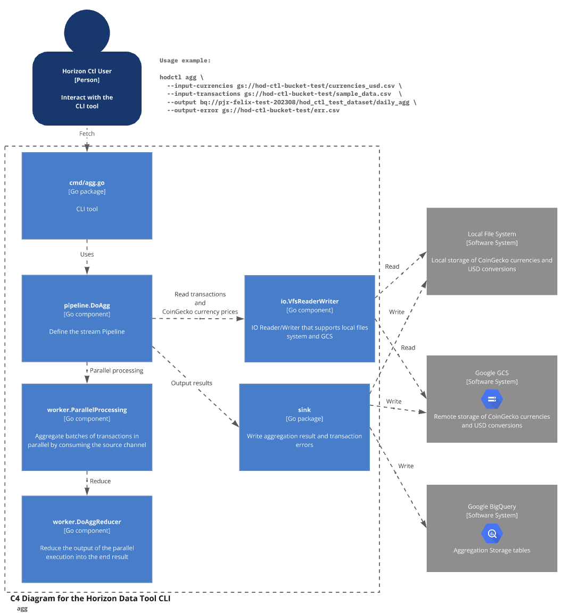
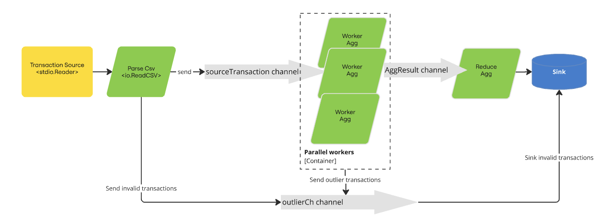

# Horizon Data Tool CLI

The CLI allows aggregation of crypto transactions from a CSV file using the current prices of the coins from CoinGecko.

## Features

* Optimized for high throughput with low memory usage rather than pure performance; in particular, the memory behavior is predictable and adjustable.
* Parallel processing of transactions following a streaming approach.
* Distributed computing is not implemented, but the system is designed to be easily scalable thanks to the MapReduce pattern.
* Multiple I/O sources supported, including local files, GCS, S3, and BigQuery.
* Dead-letter output for invalid or outlier transactions, and data cleanup and outlier detection.

> [!IMPORTANT]  
> On the other hand, this implementation is overkill for the size of the test data and type of operation. It could have been implemented in a much simpler way using a basic in-memory map and a few goroutines, or by leveraging one of the many ETL tools available, such as Apache Beam. The main goal is to showcase more advanced concepts and patterns in Go, rather than to provide the most efficient solution for the problem at hand.

## Architecture

The CLI offers two primary functionalities:

### 1. Fetch
This command retrieves the current price of all supported cryptocurrencies from the CoinGecko API and saves the data into a CSV file for later use.


### 2. Aggregate (Agg)
The aggregate command processes a CSV file containing transaction data and uses the current coin prices from CoinGecko to compute the aggregated values.



The aggregation functionality is designed as a streaming pipeline, built with bounded channels and micro-batch processing.

To efficiently handle large datasets, it implements a simple MapReduce Worker Sink pattern.


In a nutshell, the aggregation flow operates as follows:



By using this architecture, the CLI ensures that memory consumption is predictable and remains low, while still being able to handle a high throughput and process hundreds of millions of transactions in a single CSV file.

## Installation

To install the CLI, run the following command:

```bash
go install .
```

## Usage

```
$ hodctl agg --help

Welcome to Horizon Data Tooling CLI v0.1.0!
Aggregate the transaction data with currency conversion rates", 
and save the results as output

Usage:
  hodctl agg [flags]

Flags:
  -h, --help                        help for agg
  -c, --input-currencies string     Path to the currency value CSV file (gs, s3 and local file system supported) (required)
  -t, --input-transactions string   Path to the transactions CSV file (gs, s3 and local file system supported) (required)
  -b, --micro-batch-size int        Size of each micro-batch for processing (default 10000)
  -o, --output string               Path to save the aggregated result (BigQuery, gs, s3 and local file system supported) (required)
  -e, --output-error string         Path to save the error output CSV file  (gs, s3 and local file system supported) (required)
  -p, --parallelism int             Number of goroutines for parallel processing (default 14)
```

### Fetch the CoinGecko current price for all coins
```bash
# Fetch and save the current prices locally
hodctl fetch --apikey CG-xxxx --output ./testdata/currencies_usd.csv 

# Fetch and save the current prices to Google Cloud Storage (GCS)
# Ensure you have the correct permissions and are logged in using gcloud
# Command to authenticate: gcloud auth application-default login
hodctl fetch --apikey CG-xxxx --output gs://hod-ctl-bucket-test/currencies_usd.csv 
```

### Aggregate transactions

```bash
# Run with sample data
hodctl agg \
  --input-currencies ./testdata/currencies_usd.csv \
  --input-transactions ./testdata/sample_data.csv  \
  --output ./testdata/out.csv                      \
  --output-error ./testdata/err.csv

# Run with a large dataset (generate sample data using provided script)
./scripts/generate_big_sample_data.sh
hodctl agg --input-currencies ./testdata/currencies_usd.csv --input-transactions ./testdata/big_sample_data.csv --output ./testdata/out.csv --output-error ./testdata/err.csv --micro-batch-size 1000

# Run with data from GCS and save the output in GCS
hodctl agg --input-currencies gs://hod-ctl-bucket-test/currencies_usd.csv --input-transactions gs://hod-ctl-bucket-test/sample_data.csv --output gs://hod-ctl-bucket-test/out.csv --output-error gs://hod-ctl-bucket-test/err.csv

# Run with data from GCS and save the output to BigQuery
hodctl agg --input-currencies gs://hod-ctl-bucket-test/currencies_usd.csv --input-transactions gs://hod-ctl-bucket-test/sample_data.csv --output bq://pjr-felix-test-202308/hod_ctl_test_dataset/daily_agg --output-error gs://hod-ctl-bucket-test/err.csv
```

## Benchmarking

While there are several optimizations still to be made, initial benchmarks show promising performance.
The system can process 1 million rows in under 29 seconds while keeping memory usage consistently low (below 30MB throughout the process).

```
 Benchmark result for parallelism: 14, microBatchSize: 100000, 28.951503 seconds/op
```

To run the benchmarks yourself, use the following command:
```bash
# This will test with different parallelism values and micro-batch sizes
go test -bench=. ./cmd
```

## Potential improvements

This first iteration and there are several improvements that can be made:

* BQ insert are based on streaming INSERT, which is not the most efficient way to insert data into BQ but for very large Dataset could have use BQ load job API.
* BQ sink does not MERGE the data, so it will append the data to the table, which could lead to duplicates. It'll add a performance cost, but using MERGE INTO could be a good improvement.
* Streaming could be optimized to use a more efficient way to handle the data, from basic things like avoid unnecessary data copy to more complex things like using off-heap memory, but this would require a lot of work and testing and it's a premature optimization at this point.
* Based on the final use case, partitions and clustering could be optimized to improve query performance.
* Add CI/CD pipelines and package as a Docker/OCI image for fast integration and deployment.
* Add telemetry and monitoring to the CLI to track performance and usage for long-running processes.